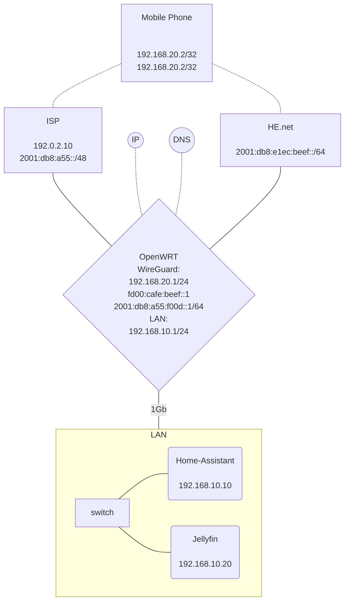
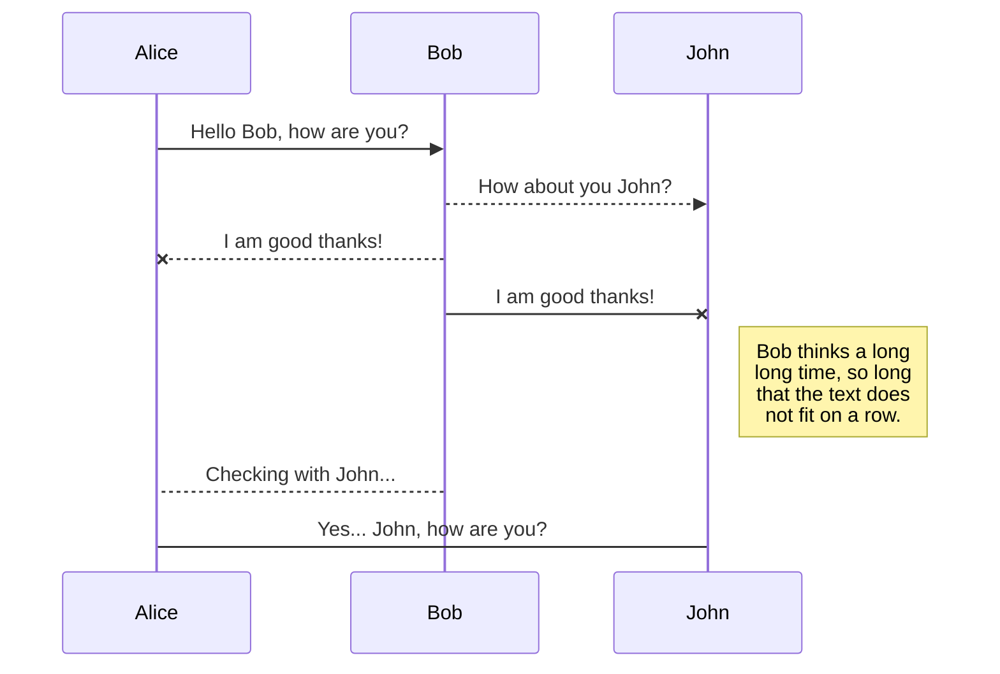

<script type="module">
	import mermaid from 'https://cdn.jsdelivr.net/npm/mermaid@10/dist/mermaid.esm.min.mjs';
	mermaid.initialize({
		startOnLoad: true,
		theme: 'dark'
	});
</script>

<script type="module">
import { LaTeXJSComponent } from "https://cdn.jsdelivr.net/npm/latex.js/dist/latex.mjs"
customElements.define("latex-js", LaTeXJSComponent)
</script>

# Wireguard VPN how-to

Diagrams from [diagrams.net](https://app.diagrams.net/)

## Intro

This guide will walk you through progressively more complex configurations which you can adapt to your use-cases. It focuses on OpenWRT 🛜 which does most configuration ⚙️ via `uci`.

### Assumptions
- You understanding networking, routing and its syntaxes.
- You can `ssh` into your router.
- You're smart enough not to use example keys from this guide.
- You've a free ⚡[Hurricane Electric IPv6 tunnel](https://tunnelbroker.net/){:target="_blank"} (`6in4`) whose interface is called `HENET` because your ISP is shit and still lives in the stone age and their chimps are afraid of big 128 bit addresses. Savages. In HE, you allocated a 64 bit prefix `2001:db8:e1ec:beef::/64`. For free.
- Maybe your ISP 🌐💩 got its shit together and provides IPv6 natively. This is via an interface called `wan6`. They provide you with `2001:db8:a55::/48`.
- Your OpenWRT 🛜 IPv6 ULA is `fd00:cafe::1/48`.
- You run OpenWRT 🛜 23. Every time you change the WireGuard config, you need to apply and restart the interface.
- Your mobile phone 📱is juuust smart enough to run the WireGuard app.
- Your mobile network provider 📶 DooDoo Cell gives you an IPv6 (what luck): `2001:db8:d00:d00:ce11::1/80`

## Plan

Before you start, document which IP ranges are in use. This helps determine which IPs to use on interfaces which terminate VPNs.

Note: while it's possible to use ProxyARPish behaviour of WireGuard within IPv4 to 'have' an IP address from a remote network locally, it sometimes wreaks havoc with routing in OpenWRT in more complex configurations. Avoid.

## Prerequisites
```
ssh root@badass.lan
...
root@badass# opkg update ; opkg install wireguard-tools luci-proto-wireguard kmod-wireguard libqrencode qrencode 
```
Install WireGuard app on your mobile.

## Case 01 - mobile 🤝 home VPN
Use case: You're going to encrypt everything, routing all traffic via your home router, and also gain access to your LAN and services there.

#### LAN Services

<svg width="64px" height="64px" viewBox="0 0 1024.00 1024.00" xmlns="http://www.w3.org/2000/svg" fill="#000" stroke="#ffffff"><g id="SVGRepo_bgCarrier" stroke-width="0"></g><g id="SVGRepo_tracerCarrier" stroke-linecap="round" stroke-linejoin="round" stroke="#CCCCCC" stroke-width="12.288"></g><g id="SVGRepo_iconCarrier"><path d="m502.4 719-.4-.4.4.4H315.2c-5.8 0-10.4-4.7-10.4-10.4v-179H258c-6.9 0-12.5-5.6-12.5-12.5 0-3.3 1.3-6.5 3.6-8.8l251.7-254.7c6.1-6.2 16-6.2 22.2-.1l.1.1 131.5 132.3v-24.5c0-5.8 4.7-10.4 10.4-10.4h43.7c5.8 0 10.4 4.7 10.4 10.4v89.9l55.9 57c4.8 4.9 4.8 12.9-.2 17.7-2.3 2.3-5.5 3.6-8.8 3.6h-46.9v178.9c0 5.8-4.7 10.4-10.4 10.4H521.4l.2-.2-.2.2 39-38.9h36c2.8 7.8 10.2 13.4 19 13.4 11.1 0 20.2-9 20.2-20.1 0-11.1-9-20.1-20.2-20.1-8.8 0-16.3 5.6-19 13.4h-41.6l-36.2 36.2v-44.1l43.1-43.1h69.7c2.8 7.8 10.2 13.4 19 13.4 11.1 0 20.2-9 20.2-20.1 0-11.1-9-20.1-20.2-20.1-8.8 0-16.3 5.6-19 13.4h-56.2l40.3-40.2v-33.6l29-28.9c2.6 1.3 5.6 2 8.7 2 11.1 0 20.2-9 20.2-20.1 0-11.1-9-20.1-20.2-20.1-11.1 0-20.2 9-20.2 20.1 0 3.1.7 6.1 2 8.7l-19.5 19.4V448c7.8-2.8 13.5-10.2 13.5-19 0-11.1-9-20.1-20.2-20.1-11.1 0-20.2 9-20.2 20.1 0 8.8 5.6 16.2 13.5 19v61.5L582.6 490c1.3-2.6 2-5.6 2-8.7 0-11.1-9-20.1-20.2-20.1s-20.2 9-20.2 20.1c0 11.1 9 20.1 20.2 20.1 3.1 0 6.1-.7 8.7-2l29 28.9v28l-36.3 36.3V566c7.8-2.8 13.5-10.2 13.5-19 0-11.1-9-20.1-20.2-20.1-11.1 0-20.2 9-20.2 20.1 0 8.8 5.6 16.2 13.5 19v40l-33.6 33.6V442.4l27.6-27.6c2.6 1.3 5.6 2 8.7 2 11.1 0 20.2-9 20.2-20.1 0-11.1-9-20.1-20.2-20.1-11.1 0-20.2 9-20.2 20.1 0 3.1.7 6.1 2 8.7l-24.8 24.8-24.8-24.8c1.3-2.6 2-5.6 2-8.7 0-11.1-9-20.1-20.2-20.1-11.1 0-20.2 9-20.2 20.1 0 11.1 9 20.1 20.2 20.1 3.1 0 6.1-.7 8.7-2l27.6 27.6v140.8L457 534.9v-38.6c7.8-2.8 13.5-10.2 13.5-19 0-11.1-9-20.1-20.2-20.1-11.1 0-20.2 9-20.2 20.1 0 8.8 5.6 16.2 13.5 19v25.2l-37.7-37.6v-37.3c7.8-2.8 13.5-10.2 13.5-19 0-11.1-9-20.1-20.2-20.1-11.1 0-20.2 9-20.2 20.1 0 8.8 5.6 16.2 13.5 19v42.9l41.6 41.5h-23.9c-2.8-7.8-10.2-13.4-19-13.4-11.1 0-20.2 9-20.2 20.1s9 20.1 20.2 20.1c8.8 0 16.3-5.6 19-13.4h37.4l57.9 57.8v100.5l-30.9-30.9v-38.7c7.8-2.8 13.5-10.2 13.5-19 0-11.1-9-20.1-20.2-20.1-11.1 0-20.2 9-20.2 20.1 0 8.8 5.6 16.2 13.5 19v25.2l-45-44.9c1.3-2.6 2-5.6 2-8.7 0-11.1-9-20.1-20.2-20.1-11.1 0-20.2 9-20.2 20.1 0 11.1 9 20.1 20.2 20.1 3.1 0 6.1-.7 8.7-2l45 44.9h-23.9c-2.8-7.8-10.2-13.4-19-13.4-11.1 0-20.2 9-20.2 20.1 0 11.1 9 20.1 20.2 20.1 8.8 0 16.3-5.6 19-13.4h37.4l37.2 37.9M398.9 419.5c-4.5 0-8.1 3.6-8.1 8.1 0 4.4 3.6 8.1 8.1 8.1s8.1-3.6 8.1-8.1-3.6-8.1-8.1-8.1zm51.1 49.7c-4.5 0-8.1 3.6-8.1 8.1 0 4.4 3.6 8.1 8.1 8.1s8.1-3.6 8.1-8.1-3.6-8.1-8.1-8.1zm18.9-80.6c-4.5 0-8.1 3.6-8.1 8.1s3.6 8.1 8.1 8.1 8.1-3.6 8.1-8.1-3.7-8.1-8.1-8.1zm184.3 100.7c4.5 0 8.1-3.6 8.1-8.1s-3.6-8.1-8.1-8.1-8.1 3.6-8.1 8.1 3.6 8.1 8.1 8.1zM555 404.7c4.5 0 8.1-3.6 8.1-8.1s-3.6-8.1-8.1-8.1-8.1 3.6-8.1 8.1 3.6 8.1 8.1 8.1zm9.4 68.5c-4.5 0-8.1 3.6-8.1 8.1s3.6 8.1 8.1 8.1 8.1-3.6 8.1-8.1-3.7-8.1-8.1-8.1zm-173.6 56.4c-4.5 0-8.1 3.6-8.1 8.1 0 4.4 3.6 8.1 8.1 8.1s8.1-3.6 8.1-8.1-3.6-8.1-8.1-8.1zm259.7 87.3c4.5 0 8.1-3.6 8.1-8.1s-3.6-8.1-8.1-8.1-8.1 3.6-8.1 8.1 3.6 8.1 8.1 8.1zm-41.7-196c-4.5 0-8.1 3.6-8.1 8.1 0 4.4 3.6 8.1 8.1 8.1s8.1-3.6 8.1-8.1c-.1-4.5-3.7-8.1-8.1-8.1zM559 539c-4.5 0-8.1 3.6-8.1 8.1s3.6 8.1 8.1 8.1 8.1-3.6 8.1-8.1-3.6-8.1-8.1-8.1zm-161.4 57.8c-4.5 0-8.1 3.6-8.1 8.1 0 4.4 3.6 8.1 8.1 8.1s8.1-3.6 8.1-8.1c-.1-4.5-3.7-8.1-8.1-8.1zm10.7 69.8c-4.5 0-8.1 3.6-8.1 8.1 0 4.4 3.6 8.1 8.1 8.1s8.1-3.6 8.1-8.1-3.6-8.1-8.1-8.1zm207.2 14.8c4.5 0 8.1-3.6 8.1-8.1 0-4.4-3.6-8.1-8.1-8.1s-8.1 3.6-8.1 8.1 3.6 8.1 8.1 8.1zm-148-75.2c-4.5 0-8.1 3.6-8.1 8.1 0 4.4 3.6 8.1 8.1 8.1s8.1-3.6 8.1-8.1-3.6-8.1-8.1-8.1z" style="fill:#000"></path> </g></svg> [home-assistant](https://www.home-assistant.io/) is accessible via [ha.lan](http://ha.lan). Config: `/etc/config/dhcp`:
```
config domain
        option ip '192.168.10.20'
        option name 'ha.lan'

config domain
        option name 'ha.lan'
        option ip 'fd00:cafe::10'
```

<svg xmlns="http://www.w3.org/2000/svg" xmlns:xlink="http://www.w3.org/1999/xlink" aria-label="Jellyfin" role="img" viewBox="0 0 512 512" width="48px" height="48px" fill="#000000"><g id="SVGRepo_bgCarrier" stroke-width="0"></g><g id="SVGRepo_tracerCarrier" stroke-linecap="round" stroke-linejoin="round"></g><g id="SVGRepo_iconCarrier"><defs><path d="M190.56 329.07c8.63 17.3 122.4 17.12 130.93 0 8.52-17.1-47.9-119.78-65.46-119.8-17.57 0-74.1 102.5-65.47 119.8z" id="A"></path><linearGradient id="B" gradientUnits="userSpaceOnUse" x1="126.15" y1="219.32" x2="457.68" y2="410.73"><stop offset="0%" stop-color="#aa5cc3"></stop><stop offset="100%" stop-color="#00a4dc"></stop></linearGradient><path d="M58.75 417.03c25.97 52.15 368.86 51.55 394.55 0S308.93 56.08 256.03 56.08c-52.92 0-223.25 308.8-197.28 360.95zm68.04-45.25c-17.02-34.17 94.6-236.5 129.26-236.5 34.67 0 146.1 202.7 129.26 236.5-16.83 33.8-241.5 34.17-258.52 0z" id="C"></path></defs><use xlink:href="#A" fill="url(#B)"></use><use xlink:href="#A" fill-opacity="0" stroke="#000000" stroke-opacity="0"></use><use xlink:href="#C" fill="url(#B)"></use><use xlink:href="#C" fill-opacity="0" stroke="#000000" stroke-opacity="0"></use></g></svg> [Jellyfin](https://jellyfin.org/) is accessible via [jellyfin.lan](http://jellyfin.lan). Config: `/etc/config/dhcp`:

```
config domain
        option ip '192.168.10.20'
        option name 'jellyfin.lan'

config domain
        option name 'jellyfin.lan'
        option ip 'fd00:cafe::20'
```
Configured with ⚙️:
```sh
uci add dhcp domain
uci set dhcp.@domain[-1].name='ha.lan'
uci set dhcp.@domain[-1].ip='192.168.10.10'
uci add dhcp domain
uci set dhcp.@domain[-1].name='ha.lan'
uci set dhcp.@domain[-1].ip='fd00:cafe::10'
uci add dhcp domain
uci set dhcp.@domain[-1].name='jellyfin.lan'
uci set dhcp.@domain[-1].ip='192.168.10.20'
uci add dhcp domain
uci set dhcp.@domain[-1].name='jellyfin.lan'
uci set dhcp.@domain[-1].ip='fd00:cafe::20'
uci commit dhcp
```

#### Diagram 01
<svg xmlns="http://www.w3.org/2000/svg" style="background-color: rgb(255, 255, 255);" xmlns:xlink="http://www.w3.org/1999/xlink" version="1.1" width="401px" height="563px" viewBox="-0.5 -0.5 401 563"><defs/><g><rect x="0" y="282" width="400" height="280" fill="rgb(255, 255, 255)" stroke="rgb(0, 0, 0)" pointer-events="all"/><ellipse cx="200" cy="291" rx="25" ry="25" fill="#fafafa" stroke="none" pointer-events="all"/><rect x="175" y="266" width="50" height="50" fill="none" stroke="none" pointer-events="all"/><path d="M 213.08 306.38 L 206.77 300.19 L 204.2 302.81 L 202.24 293.37 L 211.75 295.12 L 209.2 297.72 L 215.51 303.9 Z M 198.92 294.37 L 192.74 300.68 L 195.36 303.25 L 185.92 305.21 L 187.67 295.71 L 190.26 298.25 L 196.45 291.95 Z M 187.02 275.57 L 193.33 281.76 L 195.89 279.14 L 197.86 288.58 L 188.35 286.83 L 190.9 284.24 L 184.59 278.05 Z M 200.91 287.51 L 207.1 281.2 L 204.48 278.63 L 213.92 276.67 L 212.17 286.17 L 209.58 283.62 L 203.39 289.94 Z M 200 266 C 186.2 266 175 277.2 175 291 C 175 304.8 186.2 316 200 316 C 213.8 316 225 304.8 225 291 C 225 277.2 213.8 266 200 266 Z M 200 266.63 C 213.46 266.63 224.37 277.54 224.37 291 C 224.37 304.46 213.46 315.37 200 315.37 C 186.54 315.37 175.63 304.46 175.63 291 C 175.63 277.54 186.54 266.63 200 266.63 Z" fill="#005073" stroke="none" pointer-events="all"/><g transform="translate(-0.5 -0.5)"><switch><foreignObject style="overflow: visible; text-align: left;" pointer-events="none" width="100%" height="100%" requiredFeatures="http://www.w3.org/TR/SVG11/feature#Extensibility"><div xmlns="http://www.w3.org/1999/xhtml" style="display: flex; align-items: unsafe center; justify-content: unsafe flex-start; width: 1px; height: 1px; padding-top: 291px; margin-left: 227px;"><div style="box-sizing: border-box; font-size: 0px; text-align: left;" data-drawio-colors="color: rgb(0, 0, 0); "><div style="display: inline-block; font-size: 12px; font-family: Helvetica; color: rgb(0, 0, 0); line-height: 1.2; pointer-events: all; white-space: nowrap;">192.168.20.1/24</div></div></div></foreignObject><text x="227" y="295" fill="rgb(0, 0, 0)" font-family="Helvetica" font-size="12px">192.168.2...</text></switch></g><path d="M 175 173.7 L 175 177.48 C 175 184.49 167.34 191 159.21 191 L 111.55 191 C 103.61 191 95.52 184.87 95.52 177.37 L 95.5 174.57 C 95.5 167.8 99.37 161.51 105.79 159.36 C 105.62 153.6 107.82 148.47 111.89 144.21 C 117.29 138.67 125.81 137 132.93 139.57 C 138.41 141.59 142.56 145.67 144.62 150.43 C 148.26 148 152.85 147.91 156.65 150.72 C 158.68 152.23 160.56 154.81 160.74 158.63 C 164.44 158.97 168.29 160.76 171.39 164.52 C 173.65 167.18 174.95 170.65 175 173.7 Z" fill="#d2d3d3" stroke="none" pointer-events="all"/><path d="M 175 173.7 L 175 177.48 C 175 184.5 167.34 191 159.21 191 L 111.55 191 C 103.58 191 95.52 184.87 95.52 177.37 L 95.5 174.57 C 95.5 181.95 103.37 188.13 111.46 188.13 L 159.01 188.13 C 167.95 188.13 175 181.46 175 173.7 Z" fill-opacity="0.3" fill="#000000" stroke="none" pointer-events="all"/><rect x="95.5" y="137" width="0" height="0" fill="none" stroke="rgb(0, 0, 0)" pointer-events="all"/><path d="M 133.57 174.51 L 126.81 174.51 L 126.81 183.82 L 117.77 183.82 L 117.77 174.51 L 111.04 174.51 L 122.3 154.78 Z M 144.83 183.74 L 133.57 164 L 140.3 164 L 140.3 154.69 L 149.34 154.69 L 149.34 164 L 156.1 164 Z" fill="#ffffff" stroke="none" pointer-events="all"/><path d="M 183.81 266 L 138.71 196.35" fill="none" stroke="rgb(0, 0, 0)" stroke-miterlimit="10" pointer-events="stroke"/><path d="M 135.86 191.94 L 142.6 195.91 L 138.71 196.35 L 136.72 199.72 Z" fill="rgb(0, 0, 0)" stroke="rgb(0, 0, 0)" stroke-miterlimit="10" pointer-events="all"/><g transform="translate(-0.5 -0.5)"><switch><foreignObject style="overflow: visible; text-align: left;" pointer-events="none" width="100%" height="100%" requiredFeatures="http://www.w3.org/TR/SVG11/feature#Extensibility"><div xmlns="http://www.w3.org/1999/xhtml" style="display: flex; align-items: unsafe center; justify-content: unsafe center; width: 1px; height: 1px; padding-top: 229px; margin-left: 160px;"><div style="box-sizing: border-box; font-size: 0px; text-align: center;" data-drawio-colors="color: rgb(0, 0, 0); background-color: rgb(255, 255, 255); "><div style="display: inline-block; font-size: 11px; font-family: Helvetica; color: rgb(0, 0, 0); line-height: 1.2; pointer-events: all; background-color: rgb(255, 255, 255); white-space: nowrap;"><div>WAN</div></div></div></div></foreignObject><text x="160" y="232" fill="rgb(0, 0, 0)" font-family="Helvetica" font-size="11px" text-anchor="middle">WAN</text></switch></g><g transform="translate(-0.5 -0.5)"><switch><foreignObject style="overflow: visible; text-align: left;" pointer-events="none" width="100%" height="100%" requiredFeatures="http://www.w3.org/TR/SVG11/feature#Extensibility"><div xmlns="http://www.w3.org/1999/xhtml" style="display: flex; align-items: unsafe flex-end; justify-content: unsafe flex-start; width: 1px; height: 1px; padding-top: 275px; margin-left: 137px;"><div style="box-sizing: border-box; font-size: 0px; text-align: left;" data-drawio-colors="color: rgb(0, 0, 0); background-color: rgb(255, 255, 255); "><div style="display: inline-block; font-size: 11px; font-family: Helvetica; color: rgb(0, 0, 0); line-height: 1.2; pointer-events: all; background-color: rgb(255, 255, 255); white-space: nowrap;">WAN IP</div></div></div></foreignObject><text x="137" y="275" fill="rgb(0, 0, 0)" font-family="Helvetica" font-size="11px">WAN IP</text></switch></g><g transform="translate(-0.5 -0.5)"><switch><foreignObject style="overflow: visible; text-align: left;" pointer-events="none" width="100%" height="100%" requiredFeatures="http://www.w3.org/TR/SVG11/feature#Extensibility"><div xmlns="http://www.w3.org/1999/xhtml" style="display: flex; align-items: unsafe flex-end; justify-content: unsafe flex-end; width: 1px; height: 1px; padding-top: 205px; margin-left: 128px;"><div style="box-sizing: border-box; font-size: 0px; text-align: right;" data-drawio-colors="color: rgb(0, 0, 0); background-color: rgb(255, 255, 255); "><div style="display: inline-block; font-size: 11px; font-family: Helvetica; color: rgb(0, 0, 0); line-height: 1.2; pointer-events: all; background-color: rgb(255, 255, 255); white-space: nowrap;">0.0.0.0/0</div></div></div></foreignObject><text x="128" y="205" fill="rgb(0, 0, 0)" font-family="Helvetica" font-size="11px" text-anchor="end">0.0.0.0/0</text></switch></g><path d="M 304.5 173.7 L 304.5 177.48 C 304.5 184.49 296.84 191 288.71 191 L 241.05 191 C 233.11 191 225.02 184.87 225.02 177.37 L 225 174.57 C 225 167.8 228.87 161.51 235.29 159.36 C 235.12 153.6 237.32 148.47 241.39 144.21 C 246.79 138.67 255.31 137 262.43 139.57 C 267.91 141.59 272.06 145.67 274.12 150.43 C 277.76 148 282.35 147.91 286.15 150.72 C 288.18 152.23 290.06 154.81 290.24 158.63 C 293.94 158.97 297.79 160.76 300.89 164.52 C 303.15 167.18 304.45 170.65 304.5 173.7 Z" fill="#d2d3d3" stroke="none" pointer-events="all"/><path d="M 304.5 173.7 L 304.5 177.48 C 304.5 184.5 296.84 191 288.71 191 L 241.05 191 C 233.08 191 225.02 184.87 225.02 177.37 L 225 174.57 C 225 181.95 232.87 188.13 240.96 188.13 L 288.51 188.13 C 297.45 188.13 304.5 181.46 304.5 173.7 Z" fill-opacity="0.3" fill="#000000" stroke="none" pointer-events="all"/><rect x="225" y="137" width="0" height="0" fill="none" stroke="rgb(0, 0, 0)" pointer-events="all"/><path d="M 263.07 174.51 L 256.31 174.51 L 256.31 183.82 L 247.27 183.82 L 247.27 174.51 L 240.54 174.51 L 251.8 154.78 Z M 274.33 183.74 L 263.07 164 L 269.8 164 L 269.8 154.69 L 278.84 154.69 L 278.84 164 L 285.6 164 Z" fill="#ffffff" stroke="none" pointer-events="all"/><path d="M 217.78 273.25 L 261.59 196.53" fill="none" stroke="rgb(0, 0, 0)" stroke-miterlimit="10" pointer-events="stroke"/><path d="M 264.2 191.97 L 263.76 199.79 L 261.59 196.53 L 257.68 196.31 Z" fill="rgb(0, 0, 0)" stroke="rgb(0, 0, 0)" stroke-miterlimit="10" pointer-events="all"/><g transform="translate(-0.5 -0.5)"><switch><foreignObject style="overflow: visible; text-align: left;" pointer-events="none" width="100%" height="100%" requiredFeatures="http://www.w3.org/TR/SVG11/feature#Extensibility"><div xmlns="http://www.w3.org/1999/xhtml" style="display: flex; align-items: unsafe center; justify-content: unsafe center; width: 1px; height: 1px; padding-top: 233px; margin-left: 242px;"><div style="box-sizing: border-box; font-size: 0px; text-align: center;" data-drawio-colors="color: rgb(0, 0, 0); background-color: rgb(255, 255, 255); "><div style="display: inline-block; font-size: 11px; font-family: Helvetica; color: rgb(0, 0, 0); line-height: 1.2; pointer-events: all; background-color: rgb(255, 255, 255); white-space: nowrap;">WAN6</div></div></div></foreignObject><text x="242" y="236" fill="rgb(0, 0, 0)" font-family="Helvetica" font-size="11px" text-anchor="middle">WAN6</text></switch></g><g transform="translate(-0.5 -0.5)"><switch><foreignObject style="overflow: visible; text-align: left;" pointer-events="none" width="100%" height="100%" requiredFeatures="http://www.w3.org/TR/SVG11/feature#Extensibility"><div xmlns="http://www.w3.org/1999/xhtml" style="display: flex; align-items: unsafe flex-end; justify-content: unsafe flex-start; width: 1px; height: 1px; padding-top: 271px; margin-left: 220px;"><div style="box-sizing: border-box; font-size: 0px; text-align: left;" data-drawio-colors="color: rgb(0, 0, 0); background-color: rgb(255, 255, 255); "><div style="display: inline-block; font-size: 11px; font-family: Helvetica; color: rgb(0, 0, 0); line-height: 1.2; pointer-events: all; background-color: rgb(255, 255, 255); white-space: nowrap;">WAN6 IP</div></div></div></foreignObject><text x="220" y="271" fill="rgb(0, 0, 0)" font-family="Helvetica" font-size="11px">WAN6 IP</text></switch></g><g transform="translate(-0.5 -0.5)"><switch><foreignObject style="overflow: visible; text-align: left;" pointer-events="none" width="100%" height="100%" requiredFeatures="http://www.w3.org/TR/SVG11/feature#Extensibility"><div xmlns="http://www.w3.org/1999/xhtml" style="display: flex; align-items: unsafe flex-end; justify-content: unsafe flex-end; width: 1px; height: 1px; padding-top: 205px; margin-left: 294px;"><div style="box-sizing: border-box; font-size: 0px; text-align: right;" data-drawio-colors="color: rgb(0, 0, 0); background-color: rgb(255, 255, 255); "><div style="display: inline-block; font-size: 11px; font-family: Helvetica; color: rgb(0, 0, 0); line-height: 1.2; pointer-events: all; background-color: rgb(255, 255, 255); white-space: nowrap;">0::/0</div></div></div></foreignObject><text x="294" y="205" fill="rgb(0, 0, 0)" font-family="Helvetica" font-size="11px" text-anchor="end">0::/0</text></switch></g><rect x="183" y="17" width="34" height="34" fill="none" stroke="none" pointer-events="all"/><path d="M 183 51 L 217 51 L 217 17 L 183 17 Z" fill="#df8c42" stroke="none" pointer-events="all"/><path d="M 199.79 20.46 C 199.45 20.47 199.11 20.5 198.75 20.53 L 201.11 21.08 L 201.08 21.22 C 200.07 21.35 199.11 20.98 198.12 20.85 C 198.48 21.06 198.84 21.25 199.22 21.42 C 199.6 21.59 199.99 21.74 200.39 21.89 C 199.89 22.32 199.39 22.41 198.76 22.27 C 198.41 22.19 198.05 22.15 197.7 22.17 C 197.32 22.18 196.96 22.29 196.64 22.5 C 197 22.67 197.32 22.82 197.63 23 C 197.75 23.08 197.9 23.2 197.93 23.33 C 198 23.65 198.06 23.97 198.09 24.29 C 197.51 24.35 196.5 24.94 196.29 25.32 C 197.18 25.49 198.15 25.29 198.99 25.85 C 198.71 26.06 198.06 26.32 197.83 26.5 C 198.12 26.58 198.8 26.54 199.07 26.52 C 199.29 26.51 199.4 26.5 199.49 26.58 L 202.1 28.62 C 202.37 28.84 203.48 29.89 203.77 30.55 C 203.93 30.91 204.03 31.31 204.05 31.71 C 204.05 32.17 203.96 32.63 203.79 33.05 C 203.7 33.28 203.44 33.79 202.89 34.38 C 202.04 35.3 200.95 35.8 199.76 36.04 C 196.99 36.62 194.69 39.57 195.34 42.83 C 196.1 46.64 200.3 48.7 203.74 46.89 C 205.96 45.72 207.14 43.43 206.82 40.95 C 206.63 39.45 205.95 38.23 204.81 37.24 C 204.66 37.11 204.66 37.2 204.49 37.31 C 203.9 37.69 203.57 38.02 202.61 38.4 C 202.24 38.55 201.91 38.66 201.47 38.85 C 201.62 38.89 201.62 38.89 201.69 38.91 C 203.35 39.35 204.24 40.81 203.84 42.44 C 203.5 43.87 202.03 44.8 200.6 44.56 C 199.41 44.35 198.38 43.37 198.2 42.19 C 198.01 40.91 198.66 39.67 199.8 39.15 C 200.43 38.86 201.08 38.61 201.71 38.32 C 202.43 37.99 203.21 37.73 203.83 37.27 C 205.39 36.12 206.35 34.55 206.73 32.65 C 206.95 31.51 206.93 30.38 206.41 29.3 C 206.01 28.47 205.36 27.87 204.66 27.32 C 203.93 26.75 203.16 26.24 202.44 25.67 C 202.25 25.52 202.12 25.26 202.03 25.02 C 201.99 24.92 202.11 24.64 202.19 24.63 C 202.64 24.55 203.09 24.5 203.54 24.49 C 204.06 24.47 204.58 24.49 205.1 24.49 C 205.21 24.49 205.36 24.48 205.43 24.54 C 205.7 24.81 205.91 24.64 206.1 24.46 C 206.24 24.31 206.38 24.14 206.49 23.96 C 206.37 23.93 206.24 23.91 206.11 23.9 C 205.58 23.89 205.06 23.9 204.53 23.88 L 204.53 23.88 C 204.44 23.88 204.35 23.78 204.26 23.73 C 204.36 23.69 204.45 23.62 204.55 23.62 C 205.45 23.61 206.35 23.61 207.26 23.61 C 207.26 23.14 206.63 22.5 206.07 22.33 L 206.06 22.51 C 205.51 22.52 204.96 22.51 204.47 22.25 C 204.34 22.18 204.25 22.03 204.15 21.91 C 204.02 21.77 203.9 21.58 203.74 21.49 C 203.41 21.3 203.05 21.16 202.7 20.99 C 201.77 20.53 200.81 20.43 199.79 20.46 Z M 203.47 22.35 C 203.51 22.36 203.55 22.38 203.6 22.42 C 203.7 22.5 203.79 22.59 203.92 22.69 C 203.76 22.77 203.64 22.84 203.52 22.9 L 203.51 22.91 C 203.37 22.99 203.19 22.94 203.11 22.79 C 203.09 22.78 203.08 22.77 203.07 22.75 C 203.01 22.66 203.04 22.54 203.13 22.48 C 203.24 22.39 203.35 22.32 203.47 22.35 Z M 198.51 28.26 C 197.59 28.3 196.67 28.57 195.87 29.06 C 194.28 30.04 193.36 31.66 193.36 33.51 C 193.36 35.34 194.27 36.98 195.78 37.91 C 195.87 37.96 195.9 37.97 195.91 37.97 C 195.91 37.97 195.94 37.95 195.98 37.88 C 196.51 37.17 197.2 36.57 197.98 36.15 L 198 36.13 C 196.37 35.66 195.92 34.67 195.85 33.88 C 195.73 32.53 196.41 31.4 197.62 30.95 C 198.76 30.53 200.06 30.92 200.78 31.91 C 201.23 32.53 201.4 33.31 201.24 34.06 C 201.17 34.46 201.01 34.82 200.76 35.17 C 202.07 34.65 202.93 33.73 203.34 32.44 C 203.49 31.95 203.44 31.28 203.23 30.88 C 202.63 29.72 201.51 28.84 200.16 28.46 C 199.62 28.31 199.06 28.24 198.51 28.26 Z M 195.36 38.81 C 193.98 38.9 192.47 40.09 192.04 41.43 C 192.06 41.42 192.08 41.41 192.1 41.41 C 192.46 41.28 192.84 41.15 193.21 41.05 C 193.59 40.96 193.97 40.89 194.37 40.83 C 194.49 40.81 194.6 40.79 194.72 40.77 C 194.79 40.07 195.01 39.41 195.36 38.81 Z" fill="#ffffff" stroke="none" pointer-events="all"/><g transform="translate(-0.5 -0.5)"><switch><foreignObject style="overflow: visible; text-align: left;" pointer-events="none" width="100%" height="100%" requiredFeatures="http://www.w3.org/TR/SVG11/feature#Extensibility"><div xmlns="http://www.w3.org/1999/xhtml" style="display: flex; align-items: unsafe flex-end; justify-content: unsafe center; width: 1px; height: 1px; padding-top: 14px; margin-left: 200px;"><div style="box-sizing: border-box; font-size: 0px; text-align: center;" data-drawio-colors="color: rgb(0, 0, 0); "><div style="display: inline-block; font-size: 12px; font-family: Helvetica; color: rgb(0, 0, 0); line-height: 1.2; pointer-events: all; white-space: nowrap;">192.168.20.2/32</div></div></div></foreignObject><text x="200" y="14" fill="rgb(0, 0, 0)" font-family="Helvetica" font-size="12px" text-anchor="middle">192.1...</text></switch></g><path d="M 200 259.63 L 200 57.37" fill="none" stroke="rgb(0, 0, 0)" stroke-miterlimit="10" pointer-events="stroke"/><path d="M 200 264.88 L 196.5 257.88 L 200 259.63 L 203.5 257.88 Z" fill="rgb(0, 0, 0)" stroke="rgb(0, 0, 0)" stroke-miterlimit="10" pointer-events="all"/><path d="M 200 52.12 L 203.5 59.12 L 200 57.37 L 196.5 59.12 Z" fill="rgb(0, 0, 0)" stroke="rgb(0, 0, 0)" stroke-miterlimit="10" pointer-events="all"/><g transform="translate(-0.5 -0.5)"><switch><foreignObject style="overflow: visible; text-align: left;" pointer-events="none" width="100%" height="100%" requiredFeatures="http://www.w3.org/TR/SVG11/feature#Extensibility"><div xmlns="http://www.w3.org/1999/xhtml" style="display: flex; align-items: unsafe center; justify-content: unsafe center; width: 1px; height: 1px; padding-top: 159px; margin-left: 201px;"><div style="box-sizing: border-box; font-size: 0px; text-align: center;" data-drawio-colors="color: rgb(0, 0, 0); background-color: rgb(255, 255, 255); "><div style="display: inline-block; font-size: 11px; font-family: Helvetica; color: rgb(0, 0, 0); line-height: 1.2; pointer-events: all; background-color: rgb(255, 255, 255); white-space: nowrap;">VPN</div></div></div></foreignObject><text x="201" y="162" fill="rgb(0, 0, 0)" font-family="Helvetica" font-size="11px" text-anchor="middle">VPN</text></switch></g><path d="M 186.41 51 L 112.99 142.83" fill="none" stroke="rgb(0, 0, 0)" stroke-miterlimit="10" pointer-events="stroke"/><path d="M 109.71 146.93 L 111.35 139.27 L 112.99 142.83 L 116.82 143.65 Z" fill="rgb(0, 0, 0)" stroke="rgb(0, 0, 0)" stroke-miterlimit="10" pointer-events="all"/><g transform="translate(-0.5 -0.5)"><switch><foreignObject style="overflow: visible; text-align: left;" pointer-events="none" width="100%" height="100%" requiredFeatures="http://www.w3.org/TR/SVG11/feature#Extensibility"><div xmlns="http://www.w3.org/1999/xhtml" style="display: flex; align-items: unsafe center; justify-content: unsafe center; width: 1px; height: 1px; padding-top: 100px; margin-left: 148px;"><div style="box-sizing: border-box; font-size: 0px; text-align: center;" data-drawio-colors="color: rgb(0, 0, 0); background-color: rgb(255, 255, 255); "><div style="display: inline-block; font-size: 11px; font-family: Helvetica; color: rgb(0, 0, 0); line-height: 1.2; pointer-events: all; background-color: rgb(255, 255, 255); white-space: nowrap;">WAN</div></div></div></foreignObject><text x="148" y="103" fill="rgb(0, 0, 0)" font-family="Helvetica" font-size="11px" text-anchor="middle">WAN</text></switch></g><path d="M 212.58 51 L 282.43 145.38" fill="none" stroke="rgb(0, 0, 0)" stroke-miterlimit="10" pointer-events="stroke"/><path d="M 285.55 149.6 L 278.57 146.06 L 282.43 145.38 L 284.2 141.89 Z" fill="rgb(0, 0, 0)" stroke="rgb(0, 0, 0)" stroke-miterlimit="10" pointer-events="all"/><g transform="translate(-0.5 -0.5)"><switch><foreignObject style="overflow: visible; text-align: left;" pointer-events="none" width="100%" height="100%" requiredFeatures="http://www.w3.org/TR/SVG11/feature#Extensibility"><div xmlns="http://www.w3.org/1999/xhtml" style="display: flex; align-items: unsafe center; justify-content: unsafe center; width: 1px; height: 1px; padding-top: 101px; margin-left: 250px;"><div style="box-sizing: border-box; font-size: 0px; text-align: center;" data-drawio-colors="color: rgb(0, 0, 0); background-color: rgb(255, 255, 255); "><div style="display: inline-block; font-size: 11px; font-family: Helvetica; color: rgb(0, 0, 0); line-height: 1.2; pointer-events: all; background-color: rgb(255, 255, 255); white-space: nowrap;">WAN6</div></div></div></foreignObject><text x="250" y="105" fill="rgb(0, 0, 0)" font-family="Helvetica" font-size="11px" text-anchor="middle">WAN6</text></switch></g><rect x="150" y="347" width="100" height="20" fill="none" stroke="none" pointer-events="all"/><g transform="translate(-0.5 -0.5)"><switch><foreignObject style="overflow: visible; text-align: left;" pointer-events="none" width="100%" height="100%" requiredFeatures="http://www.w3.org/TR/SVG11/feature#Extensibility"><div xmlns="http://www.w3.org/1999/xhtml" style="display: flex; align-items: unsafe center; justify-content: unsafe center; width: 1px; height: 1px; padding-top: 357px; margin-left: 200px;"><div style="box-sizing: border-box; font-size: 0px; text-align: center;" data-drawio-colors="color: rgb(0, 0, 0); "><div style="display: inline-block; font-size: 12px; font-family: Helvetica; color: rgb(0, 0, 0); line-height: 1.2; pointer-events: all; white-space: nowrap;">192.168.10.0/24</div></div></div></foreignObject><text x="200" y="361" fill="rgb(0, 0, 0)" font-family="Helvetica" font-size="12px" text-anchor="middle">192.168.10.0/24</text></switch></g><image x="4.5" y="413.5" width="120" height="120" xlink:href="data:image/svg+xml;base64,PHN2ZyB2aWV3Qm94PSIwIDAgNTEyIDUxMiIgcm9sZT0iaW1nIiBhcmlhLWxhYmVsPSJKZWxseWZpbiIgeG1sbnM6eGxpbms9Imh0dHA6Ly93d3cudzMub3JnLzE5OTkveGxpbmsiIHhtbG5zPSJodHRwOi8vd3d3LnczLm9yZy8yMDAwL3N2ZyI+PHJlY3QgZmlsbD0iI2ZmZmZmZiIgcng9IjE1JSIgaGVpZ2h0PSI1MTIiIHdpZHRoPSI1MTIiLz48ZGVmcz48cGF0aCBpZD0iQSIgZD0iTTE5MC41NiAzMjkuMDdjOC42MyAxNy4zIDEyMi40IDE3LjEyIDEzMC45MyAwIDguNTItMTcuMS00Ny45LTExOS43OC02NS40Ni0xMTkuOC0xNy41NyAwLTc0LjEgMTAyLjUtNjUuNDcgMTE5Ljh6Ii8+PGxpbmVhckdyYWRpZW50IHkyPSI0MTAuNzMiIHgyPSI0NTcuNjgiIHkxPSIyMTkuMzIiIHgxPSIxMjYuMTUiIGdyYWRpZW50VW5pdHM9InVzZXJTcGFjZU9uVXNlIiBpZD0iQiI+PHN0b3Agc3RvcC1jb2xvcj0iI2FhNWNjMyIgb2Zmc2V0PSIwJSIvPjxzdG9wIHN0b3AtY29sb3I9IiMwMGE0ZGMiIG9mZnNldD0iMTAwJSIvPjwvbGluZWFyR3JhZGllbnQ+PHBhdGggaWQ9IkMiIGQ9Ik01OC43NSA0MTcuMDNjMjUuOTcgNTIuMTUgMzY4Ljg2IDUxLjU1IDM5NC41NSAwUzMwOC45MyA1Ni4wOCAyNTYuMDMgNTYuMDhjLTUyLjkyIDAtMjIzLjI1IDMwOC44LTE5Ny4yOCAzNjAuOTV6bTY4LjA0LTQ1LjI1Yy0xNy4wMi0zNC4xNyA5NC42LTIzNi41IDEyOS4yNi0yMzYuNSAzNC42NyAwIDE0Ni4xIDIwMi43IDEyOS4yNiAyMzYuNS0xNi44MyAzMy44LTI0MS41IDM0LjE3LTI1OC41MiAweiIvPjwvZGVmcz48dXNlIGZpbGw9InVybCgjQikiIHhsaW5rOmhyZWY9IiNBIi8+PHVzZSBzdHJva2Utb3BhY2l0eT0iMCIgc3Ryb2tlPSIjMDAwMDAwIiBmaWxsLW9wYWNpdHk9IjAiIHhsaW5rOmhyZWY9IiNBIi8+PHVzZSBmaWxsPSJ1cmwoI0IpIiB4bGluazpocmVmPSIjQyIvPjx1c2Ugc3Ryb2tlLW9wYWNpdHk9IjAiIHN0cm9rZT0iIzAwMDAwMCIgZmlsbC1vcGFjaXR5PSIwIiB4bGluazpocmVmPSIjQyIvPjwvc3ZnPg==" preserveAspectRatio="none"/><g fill="rgb(0, 0, 0)" font-family="Helvetica" text-anchor="middle" font-size="12px"><text x="64.5" y="551.5">192.168.10.20</text></g><image x="324.5" y="469.5" width="64" height="64" xlink:href="data:image/svg+xml;base64,PHN2ZyBzdHJva2U9IiNmZmZmZmYiIGZpbGw9IiNmZmZmZmYiIHhtbG5zPSJodHRwOi8vd3d3LnczLm9yZy8yMDAwL3N2ZyIgdmlld0JveD0iMCAwIDEwMjQuMDAgMTAyNC4wMCIgaGVpZ2h0PSI2NHB4IiB3aWR0aD0iNjRweCI+PGcgc3Ryb2tlLXdpZHRoPSIwIiBpZD0iU1ZHUmVwb19iZ0NhcnJpZXIiLz48ZyBzdHJva2Utd2lkdGg9IjEyLjI4OCIgc3Ryb2tlPSIjQ0NDQ0NDIiBzdHJva2UtbGluZWpvaW49InJvdW5kIiBzdHJva2UtbGluZWNhcD0icm91bmQiIGlkPSJTVkdSZXBvX3RyYWNlckNhcnJpZXIiLz48ZyBpZD0iU1ZHUmVwb19pY29uQ2FycmllciI+IDxjaXJjbGUgc3R5bGU9ImZpbGw6IzQxYmRmNSIgcj0iNTEyIiBjeT0iNTEyIiBjeD0iNTEyIi8+IDxwYXRoIHN0eWxlPSJmaWxsOiMwMDAiIGQ9Im01MDIuNCA3MTktLjQtLjQuNC40SDMxNS4yYy01LjggMC0xMC40LTQuNy0xMC40LTEwLjR2LTE3OUgyNThjLTYuOSAwLTEyLjUtNS42LTEyLjUtMTIuNSAwLTMuMyAxLjMtNi41IDMuNi04LjhsMjUxLjctMjU0LjdjNi4xLTYuMiAxNi02LjIgMjIuMi0uMWwuMS4xIDEzMS41IDEzMi4zdi0yNC41YzAtNS44IDQuNy0xMC40IDEwLjQtMTAuNGg0My43YzUuOCAwIDEwLjQgNC43IDEwLjQgMTAuNHY4OS45bDU1LjkgNTdjNC44IDQuOSA0LjggMTIuOS0uMiAxNy43LTIuMyAyLjMtNS41IDMuNi04LjggMy42aC00Ni45djE3OC45YzAgNS44LTQuNyAxMC40LTEwLjQgMTAuNEg1MjEuNGwuMi0uMi0uMi4yIDM5LTM4LjloMzZjMi44IDcuOCAxMC4yIDEzLjQgMTkgMTMuNCAxMS4xIDAgMjAuMi05IDIwLjItMjAuMSAwLTExLjEtOS0yMC4xLTIwLjItMjAuMS04LjggMC0xNi4zIDUuNi0xOSAxMy40aC00MS42bC0zNi4yIDM2LjJ2LTQ0LjFsNDMuMS00My4xaDY5LjdjMi44IDcuOCAxMC4yIDEzLjQgMTkgMTMuNCAxMS4xIDAgMjAuMi05IDIwLjItMjAuMSAwLTExLjEtOS0yMC4xLTIwLjItMjAuMS04LjggMC0xNi4zIDUuNi0xOSAxMy40aC01Ni4ybDQwLjMtNDAuMnYtMzMuNmwyOS0yOC45YzIuNiAxLjMgNS42IDIgOC43IDIgMTEuMSAwIDIwLjItOSAyMC4yLTIwLjEgMC0xMS4xLTktMjAuMS0yMC4yLTIwLjEtMTEuMSAwLTIwLjIgOS0yMC4yIDIwLjEgMCAzLjEuNyA2LjEgMiA4LjdsLTE5LjUgMTkuNFY0NDhjNy44LTIuOCAxMy41LTEwLjIgMTMuNS0xOSAwLTExLjEtOS0yMC4xLTIwLjItMjAuMS0xMS4xIDAtMjAuMiA5LTIwLjIgMjAuMSAwIDguOCA1LjYgMTYuMiAxMy41IDE5djYxLjVMNTgyLjYgNDkwYzEuMy0yLjYgMi01LjYgMi04LjcgMC0xMS4xLTktMjAuMS0yMC4yLTIwLjFzLTIwLjIgOS0yMC4yIDIwLjFjMCAxMS4xIDkgMjAuMSAyMC4yIDIwLjEgMy4xIDAgNi4xLS43IDguNy0ybDI5IDI4Ljl2MjhsLTM2LjMgMzYuM1Y1NjZjNy44LTIuOCAxMy41LTEwLjIgMTMuNS0xOSAwLTExLjEtOS0yMC4xLTIwLjItMjAuMS0xMS4xIDAtMjAuMiA5LTIwLjIgMjAuMSAwIDguOCA1LjYgMTYuMiAxMy41IDE5djQwbC0zMy42IDMzLjZWNDQyLjRsMjcuNi0yNy42YzIuNiAxLjMgNS42IDIgOC43IDIgMTEuMSAwIDIwLjItOSAyMC4yLTIwLjEgMC0xMS4xLTktMjAuMS0yMC4yLTIwLjEtMTEuMSAwLTIwLjIgOS0yMC4yIDIwLjEgMCAzLjEuNyA2LjEgMiA4LjdsLTI0LjggMjQuOC0yNC44LTI0LjhjMS4zLTIuNiAyLTUuNiAyLTguNyAwLTExLjEtOS0yMC4xLTIwLjItMjAuMS0xMS4xIDAtMjAuMiA5LTIwLjIgMjAuMSAwIDExLjEgOSAyMC4xIDIwLjIgMjAuMSAzLjEgMCA2LjEtLjcgOC43LTJsMjcuNiAyNy42djE0MC44TDQ1NyA1MzQuOXYtMzguNmM3LjgtMi44IDEzLjUtMTAuMiAxMy41LTE5IDAtMTEuMS05LTIwLjEtMjAuMi0yMC4xLTExLjEgMC0yMC4yIDktMjAuMiAyMC4xIDAgOC44IDUuNiAxNi4yIDEzLjUgMTl2MjUuMmwtMzcuNy0zNy42di0zNy4zYzcuOC0yLjggMTMuNS0xMC4yIDEzLjUtMTkgMC0xMS4xLTktMjAuMS0yMC4yLTIwLjEtMTEuMSAwLTIwLjIgOS0yMC4yIDIwLjEgMCA4LjggNS42IDE2LjIgMTMuNSAxOXY0Mi45bDQxLjYgNDEuNWgtMjMuOWMtMi44LTcuOC0xMC4yLTEzLjQtMTktMTMuNC0xMS4xIDAtMjAuMiA5LTIwLjIgMjAuMXM5IDIwLjEgMjAuMiAyMC4xYzguOCAwIDE2LjMtNS42IDE5LTEzLjRoMzcuNGw1Ny45IDU3Ljh2MTAwLjVsLTMwLjktMzAuOXYtMzguN2M3LjgtMi44IDEzLjUtMTAuMiAxMy41LTE5IDAtMTEuMS05LTIwLjEtMjAuMi0yMC4xLTExLjEgMC0yMC4yIDktMjAuMiAyMC4xIDAgOC44IDUuNiAxNi4yIDEzLjUgMTl2MjUuMmwtNDUtNDQuOWMxLjMtMi42IDItNS42IDItOC43IDAtMTEuMS05LTIwLjEtMjAuMi0yMC4xLTExLjEgMC0yMC4yIDktMjAuMiAyMC4xIDAgMTEuMSA5IDIwLjEgMjAuMiAyMC4xIDMuMSAwIDYuMS0uNyA4LjctMmw0NSA0NC45aC0yMy45Yy0yLjgtNy44LTEwLjItMTMuNC0xOS0xMy40LTExLjEgMC0yMC4yIDktMjAuMiAyMC4xIDAgMTEuMSA5IDIwLjEgMjAuMiAyMC4xIDguOCAwIDE2LjMtNS42IDE5LTEzLjRoMzcuNGwzNy4yIDM3LjlNMzk4LjkgNDE5LjVjLTQuNSAwLTguMSAzLjYtOC4xIDguMSAwIDQuNCAzLjYgOC4xIDguMSA4LjFzOC4xLTMuNiA4LjEtOC4xLTMuNi04LjEtOC4xLTguMXptNTEuMSA0OS43Yy00LjUgMC04LjEgMy42LTguMSA4LjEgMCA0LjQgMy42IDguMSA4LjEgOC4xczguMS0zLjYgOC4xLTguMS0zLjYtOC4xLTguMS04LjF6bTE4LjktODAuNmMtNC41IDAtOC4xIDMuNi04LjEgOC4xczMuNiA4LjEgOC4xIDguMSA4LjEtMy42IDguMS04LjEtMy43LTguMS04LjEtOC4xem0xODQuMyAxMDAuN2M0LjUgMCA4LjEtMy42IDguMS04LjFzLTMuNi04LjEtOC4xLTguMS04LjEgMy42LTguMSA4LjEgMy42IDguMSA4LjEgOC4xek01NTUgNDA0LjdjNC41IDAgOC4xLTMuNiA4LjEtOC4xcy0zLjYtOC4xLTguMS04LjEtOC4xIDMuNi04LjEgOC4xIDMuNiA4LjEgOC4xIDguMXptOS40IDY4LjVjLTQuNSAwLTguMSAzLjYtOC4xIDguMXMzLjYgOC4xIDguMSA4LjEgOC4xLTMuNiA4LjEtOC4xLTMuNy04LjEtOC4xLTguMXptLTE3My42IDU2LjRjLTQuNSAwLTguMSAzLjYtOC4xIDguMSAwIDQuNCAzLjYgOC4xIDguMSA4LjFzOC4xLTMuNiA4LjEtOC4xLTMuNi04LjEtOC4xLTguMXptMjU5LjcgODcuM2M0LjUgMCA4LjEtMy42IDguMS04LjFzLTMuNi04LjEtOC4xLTguMS04LjEgMy42LTguMSA4LjEgMy42IDguMSA4LjEgOC4xem0tNDEuNy0xOTZjLTQuNSAwLTguMSAzLjYtOC4xIDguMSAwIDQuNCAzLjYgOC4xIDguMSA4LjFzOC4xLTMuNiA4LjEtOC4xYy0uMS00LjUtMy43LTguMS04LjEtOC4xek01NTkgNTM5Yy00LjUgMC04LjEgMy42LTguMSA4LjFzMy42IDguMSA4LjEgOC4xIDguMS0zLjYgOC4xLTguMS0zLjYtOC4xLTguMS04LjF6bS0xNjEuNCA1Ny44Yy00LjUgMC04LjEgMy42LTguMSA4LjEgMCA0LjQgMy42IDguMSA4LjEgOC4xczguMS0zLjYgOC4xLTguMWMtLjEtNC41LTMuNy04LjEtOC4xLTguMXptMTAuNyA2OS44Yy00LjUgMC04LjEgMy42LTguMSA4LjEgMCA0LjQgMy42IDguMSA4LjEgOC4xczguMS0zLjYgOC4xLTguMS0zLjYtOC4xLTguMS04LjF6bTIwNy4yIDE0LjhjNC41IDAgOC4xLTMuNiA4LjEtOC4xIDAtNC40LTMuNi04LjEtOC4xLTguMXMtOC4xIDMuNi04LjEgOC4xIDMuNiA4LjEgOC4xIDguMXptLTE0OC03NS4yYy00LjUgMC04LjEgMy42LTguMSA4LjEgMCA0LjQgMy42IDguMSA4LjEgOC4xczguMS0zLjYgOC4xLTguMS0zLjYtOC4xLTguMS04LjF6Ii8+IDwvZz48L3N2Zz4=" preserveAspectRatio="none"/><g fill="rgb(0, 0, 0)" font-family="Helvetica" text-anchor="middle" font-size="12px"><text x="356.5" y="551.5">192.168.10.10</text></g></g><switch><g requiredFeatures="http://www.w3.org/TR/SVG11/feature#Extensibility"/><a transform="translate(0,-5)" xlink:href="https://www.drawio.com/doc/faq/svg-export-text-problems" target="_blank"><text text-anchor="middle" font-size="10px" x="50%" y="100%">Text is not SVG - cannot display</text></a></switch></svg>




* 🌐Router WAN4 IPv4 `192.0.2.10`
* 🌐Router WAN6 IPv6 `2001:db8:a55:f00d::1/64`
* 🛜Router LAN IPv4 `192.168.10.1`
* 🛜Router ULA LAN IPv6 `fd00:cafe::1/48`
* 🛜Router IPv6 ULA prefix `fd00:cafe::/48`
* 🛜LAN IPv4 network `192.168.10.0/24`
* 🔒VPN IPv4 network `192.168.20.0/24`
* 🔒VPN ULA IPv6 `fd00:cafe:beef::1/64`
* 🔒VPN HE IPv6 prefix `2001:db8:e1ec:beef:f00d::/80`
* 🔒⚡VPN HE IPv6 `2001:db8:e1ec:beef:f00d::1/80`

#### Step 01 - router ⚙️
UCI Commands:
```sh
uci add firewall zone
uci set firewall.@zone[-1].name='wg0'
uci set firewall.@zone[-1].input='ACCEPT'
uci set firewall.@zone[-1].output='ACCEPT'
uci set firewall.@zone[-1].forward='ACCEPT'
uci set firewall.@zone[-1].masq='1' # masquerading. useful later.
uci add_list firewall.@zone[-1].network='wg0'

uci add firewall rule
uci set firewall.@rule[-1].name='Allow-Wireguard-Input-to-Router'
uci add_list firewall.@rule[-1].proto='udp'
uci set firewall.@rule[-1].src='*'
uci set firewall.@rule[-1].dest_port='1234'
uci set firewall.@rule[-1].target='ACCEPT'

uci set network.wg0=interface
uci set network.wg0.proto='wireguard'
uci set network.wg0.private_key=$(wg genkey)
uci add_list network.wg0.addresses='192.168.20.1/24'
uci add_list network.wg0.addresses='fd00:cafe:beef::1/64'
uci add_list network.wg0.addresses='2001:db8:e1ec:beef:f00d::1/80'
uci add_list network.wg0.ip6class='local'
uci add_list network.wg0.ip6class='HENET'

uci commit network
uci commit firewall
```

> **Verify**  ✅

Resulting `/etc/config/network`:
```
...
config interface 'wg0'
        option proto 'wireguard'
        option private_key 'aaaaaaaaaaaaaaaaaaaaaaaaaaaaaaaaaaaaaaaaaaA='
        option listen_port '1234'
        list ip6class 'HENET'
        list ip6class 'local'
        list addresses '192.168.20.1/24'
        list addresses 'fd00:cafe:beef::1/64'
        list addresses '2001:db8:e1ec:beef:f00d::1/80'
```
Resulting `/etc/config/firewall`:
```
...
config zone
        option name 'wg0'
        list network 'wg0'
        option input 'ACCEPT'
        option output 'ACCEPT'
        option forward 'ACCEPT'

config rule
        list proto 'udp'
        option dest_port '1234'
        option target 'ACCEPT'
        option src '*'
        option name 'Allow-Wireguard-Input-to-Router'
```

Great. Now your router is set to receive WireGuard UDP traffic on port 1234.

Next up is your mobile phone.  On your mobile, check [https://www.whatsmyip.org/](https://www.whatsmyip.org/). You see your mobile carrier provided IP e.g. `192.0.2.254`, or even `2001:db8:d00:d00:ce11::1/80`.

#### Step 02 - router ⚙️

##### Addresses
* 📶Mobile WAN4 IPv4 `192.0.2.254`
* 📶Mobile WAN6 IPv6 `2001:db8:d00:d00:ce11::1/80`
* 🔒Mobile LAN IPv4 `192.168.20.2/32`
* 🔒Mobile ULA IPv6 `fd00:cafe:beef::2/128`
* 🔒⚡Mobile HE IPv6 `2001:db8:e1ec:beef:f00d::2/128`

UCI Commands:
```sh
mypriv8key=$(wg genkey)
mypubkey=$(echo $mypriv8key | wg pubkey)
mypsk=$(wg genpsk)
uci add network wireguard_wg0
uci set network.@wireguard_wg0[-1].public_key=$mypubkey
uci set network.@wireguard_wg0[-1].private_key=$mypriv8key
uci set network.@wireguard_wg0[-1].description='mobile-phone'
uci set network.@wireguard_wg0[-1].preshared_key=$mypsk
uci add_list network.@wireguard_wg0[-1].allowed_ips='192.168.20.2/32'
uci add_list network.@wireguard_wg0[-1].allowed_ips='fd00:cafe:beef::2/128'
uci add_list network.@wireguard_wg0[-1].allowed_ips='2001:db8:e1ec:beef:f00d::2/128'
uci set network.@wireguard_wg0[-1].route_allowed_ips='1'
uci commit network
/etc/init.d/network restart
```
In luci:
1. go to network
2. interfaces
3. wg0
4. edit
5. peers
6. mobile-phone
7. edit
8. Configuration Export ---> Generate configuration

Allowed IPs has ...
* `0.0.0.0/0` to route traffic to all IPv4 destinations and 
* `::/0` in order to route traffic to all IPv6 destinations respectively over the VPN.

Lower down is the QR code.

Open WireGuard on your mobile:
1. and add a new VPN (`+`)
2. create from QR Code
3. Scan the QR Code
4. Name it `home`
5. Turn it on
6. Bam


> **Verify**  ✅

Resulting `/etc/config/network`:
```
...
config interface 'wg0'
        option proto 'wireguard'
        option private_key 'aaaaaaaaaaaaaaaaaaaaaaaaaaaaaaaaaaaaaaaaaaA='
        option listen_port '1234'
        list ip6class 'HENET'
        list ip6class 'local'
        list addresses '192.168.20.1/24'
        list addresses 'fd00:cafe:beef::1/64'
        list addresses '2001:db8:e1ec:beef:f00d::1/80'

config wireguard_wg2
        option public_key 'aaaaaaaaaaaaaaaaaaaaaaaaaaaaaaaaaaaaaaaaaaD='
        option private_key 'aaaaaaaaaaaaaaaaaaaaaaaaaaaaaaaaaaaaaaaaaaB='
        option description 'mobile-phone'
        option preshared_key 'aaaaaaaaaaaaaaaaaaaaaaaaaaaaaaaaaaaaaaaaaaC='
        list allowed_ips '192.168.20.2/32'
        list allowed_ips 'fd00:cafe:beef::2/128'
        list allowed_ips '2001:db8:e1ec:beef:f00d::2/128'
        option route_allowed_ips '1'
```

On your mobile, disable Wi-Fi if you're home, enable mobile data, check [https://www.whatsmyip.org/](https://www.whatsmyip.org/). You see your home IP `192.0.2.10`.
Check [https://ipv6-test.com/](https://ipv6-test.com/). You see your HE IPv6 `2001:db8:e1ec:beef:f00d::1`.
Check [ha.lan](http://ha.lan).  Check [jellyfin.lan](http://jellyfin.lan).


## Case 02 - laptop 🤝 home VPN

Largely identical to the mobile case, we simply install the WireGuard app on the laptop (macOS, windows, etc) or the WireGuard packages if it's Linux or whatever.

* 🔒Laptop LAN IPv4 `192.168.20.3/32`
* 🔒Laptop ULA IPv6 `fd00:cafe:beef::3/128`
* 🔒⚡Laptop HE IPv6 `2001:db8:e1ec:beef:f00d::3/128`

#### Step 01 - router ⚙️
UCI Commands:
```sh
mypriv8key=$(wg genkey)
mypubkey=$(echo $mypriv8key | wg pubkey)
mypsk=$(wg genpsk)
uci add network wireguard_wg0
uci set network.@wireguard_wg0[-1].public_key=$mypubkey
uci set network.@wireguard_wg0[-1].private_key=$mypriv8key
uci set network.@wireguard_wg0[-1].description='laptop'
uci set network.@wireguard_wg0[-1].preshared_key=$mypsk
uci add_list network.@wireguard_wg0[-1].allowed_ips='192.168.20.3/32'
uci add_list network.@wireguard_wg0[-1].allowed_ips='fd00:cafe:beef::3/128'
uci add_list network.@wireguard_wg0[-1].allowed_ips='2001:db8:e1ec:beef:f00d::3/128'
uci set network.@wireguard_wg0[-1].route_allowed_ips='1'
uci commit network
/etc/init.d/network restart
```

> **Verify**  ✅

Resulting `/etc/config/network`:
```
...
config wireguard_wg2
        option public_key 'aaaaaaaaaaaaaaaaaaaaaaaaaaaaaaaaaaaaaaaaaaG='
        option private_key 'aaaaaaaaaaaaaaaaaaaaaaaaaaaaaaaaaaaaaaaaaaE='
        option description 'mobile-phone'
        option preshared_key 'aaaaaaaaaaaaaaaaaaaaaaaaaaaaaaaaaaaaaaaaaaF='
        list allowed_ips '192.168.20.3/32'
        list allowed_ips 'fd00:cafe:beef::3/128'
        list allowed_ips '2001:db8:e1ec:beef:f00d::3/128'
        option route_allowed_ips '1'
```

#### Step 02 - laptop 💻
Visit the luci interface of your router at `192.168.10.1` while connected to the home LAN:
1. go to network
2. interfaces
3. wg0
4. edit
5. peers
6. laptop
7. edit
8. Configuration Export ---> Generate configuration

Allowed IPs has ...
* `0.0.0.0/0` to route traffic to all IPv4 destinations and 
* `::/0` in order to route traffic to all IPv6 destinations respectively over the VPN.

Lower down is the QR code. Beside it, CTRL+C the text field contents with:
```
[Interface]
PrivateKey = aaaaaaaaaaaaaaaaaaaaaaaaaaaaaaaaaaaaaaaaaaE=
Address = 192.168.20.3/32, fd00:cafe:beef::3/128, 2001:db8:e1ec:beef:f00d::3/128
DNS = 192.168.10.1

[Peer]
PublicKey = aaaaaaaaaaaaaaaaaaaaaaaaaaaaaaaaaaaaaaaaaaG=
PresharedKey = aaaaaaaaaaaaaaaaaaaaaaaaaaaaaaaaaaaaaaaaaaF=
AllowedIPs = 0.0.0.0/0, ::/0
Endpoint = 192.0.2.10:1234
```

Open WireGuard on your laptop  💻:
1. add empty tunnel (`+`)
2. select all, CTRL+A
3. CTRL+V to replace everything
4. Name it `home`
5. Turn it on
6. Bam

> **Verify** ✅ 🔍

In your laptop command prompt, check VPN IPv4 🔍:
```sh
# ping 192.168.10.1
PING 192.168.10.1 (192.168.10.1): 56 data bytes
64 bytes from 192.168.10.1: seq=0 ttl=64 time=2.309 ms
64 bytes from 192.168.10.1: seq=1 ttl=64 time=5.493 ms
64 bytes from 192.168.10.1: seq=2 ttl=64 time=8.865 ms
64 bytes from 192.168.10.1: seq=3 ttl=64 time=8.465 ms
64 bytes from 192.168.10.1: seq=4 ttl=64 time=8.178 ms
64 bytes from 192.168.10.1: seq=5 ttl=64 time=8.549 ms
^C
--- 192.168.10.1 ping statistics ---
6 packets transmitted, 6 packets received, 0% packet loss
round-trip min/avg/max = 2.309/6.976/8.865 ms
```
In your laptop command prompt, check VPN ULA IPv6 🔍:
```sh
# ping6 fd00:cafe:beef::1
PING6(56=40+8+8 bytes) fd00:cafe:beef::3 --> fd00:cafe:beef::1
16 bytes from fd00:cafe:beef::1, icmp_seq=0 hlim=64 time=0.488 ms
16 bytes from fd00:cafe:beef::1, icmp_seq=1 hlim=64 time=0.468 ms
16 bytes from fd00:cafe:beef::1, icmp_seq=2 hlim=64 time=0.551 ms
16 bytes from fd00:cafe:beef::1, icmp_seq=3 hlim=64 time=0.487 ms
16 bytes from fd00:cafe:beef::1, icmp_seq=4 hlim=64 time=0.569 ms
16 bytes from fd00:cafe:beef::1, icmp_seq=5 hlim=64 time=0.735 ms
^C
--- fd00:cafe:beef::1 ping6 statistics ---
6 packets transmitted, 6 packets received, 0.0% packet loss
round-trip min/avg/max/std-dev = 0.468/0.550/0.735/0.090 ms
```
In your laptop command prompt, check VPN HE IPv6 🔍:
```sh
# ping6 2001:db8:e1ec:beef:f00d::1
PING6(56=40+8+8 bytes) 2001:db8:e1ec:beef:f00d::3 --> 2001:db8:e1ec:beef:f00d::1
16 bytes from 2001:db8:e1ec:beef:f00d::1, icmp_seq=0 hlim=64 time=0.488 ms
16 bytes from 2001:db8:e1ec:beef:f00d::1, icmp_seq=1 hlim=64 time=0.468 ms
16 bytes from 2001:db8:e1ec:beef:f00d::1, icmp_seq=2 hlim=64 time=0.551 ms
16 bytes from 2001:db8:e1ec:beef:f00d::1, icmp_seq=3 hlim=64 time=0.487 ms
16 bytes from 2001:db8:e1ec:beef:f00d::1, icmp_seq=4 hlim=64 time=0.569 ms
16 bytes from 2001:db8:e1ec:beef:f00d::1, icmp_seq=5 hlim=64 time=0.735 ms
^C
--- 2001:db8:e1ec:beef:f00d::1 ping6 statistics ---
6 packets transmitted, 6 packets received, 0.0% packet loss
round-trip min/avg/max/std-dev = 0.468/0.550/0.735/0.090 ms
```
In your laptop command prompt, check a Global IPv6 🔍:
```sh
ping6 ipv6.google.com
PING6(56=40+8+8 bytes) 2001:9b0:21a:2a00:b5e8:fa64:1f7a:7707 --> 2a00:1450:400f:805::200e
16 bytes from 2a00:1450:400f:805::200e, icmp_seq=0 hlim=60 time=2.433 ms
16 bytes from 2a00:1450:400f:805::200e, icmp_seq=1 hlim=60 time=2.480 ms
^C
--- ipv6.l.google.com ping6 statistics ---
2 packets transmitted, 2 packets received, 0.0% packet loss
round-trip min/avg/max/std-dev = 2.433/2.457/2.480/0.023 ms
```

# Markdown extensions

StackEdit extends the standard Markdown syntax by adding extra **Markdown extensions**, providing you with some nice features.

> **ProTip:** You can disable any **Markdown extension** in the **File properties** dialog.


## SmartyPants

SmartyPants converts ASCII punctuation characters into "smart" typographic punctuation HTML entities. For example:

|                |ASCII                          |HTML                         |
|----------------|-------------------------------|-----------------------------|
|Single backticks|`'Isn't this fun?'`            |'Isn't this fun?'            |
|Quotes          |`"Isn't this fun?"`            |"Isn't this fun?"            |
|Dashes          |`-- is en-dash, --- is em-dash`|-- is en-dash, --- is em-dash|


## LaTeX

**The Cauchy-Schwarz Inequality**

```math
\left( \sum_{k=1}^n a_k b_k \right)^2 \leq \left( \sum_{k=1}^n a_k^2 \right) \left( \sum_{k=1}^n b_k^2 \right)
```
<pre class="latex-js">
\left( \sum_{k=1}^n a_k b_k \right)^2 \leq \left( \sum_{k=1}^n a_k^2 \right) \left( \sum_{k=1}^n b_k^2 \right)
</pre>


## UML diagrams

You can render UML diagrams using [Mermaid](https://mermaidjs.github.io/). For example, this will produce a sequence diagram:


<pre class="mermaid">
sequenceDiagram
Alice ->> Bob: Hello Bob, how are you?
Bob-->>John: How about you John?
Bob--x Alice: I am good thanks!
Bob-x John: I am good thanks!
Note right of John: Bob thinks a long<br/>long time, so long<br/>that the text does<br/>not fit on a row.

Bob-->Alice: Checking with John...
Alice->John: Yes... John, how are you?
</pre>


Here is a simple flow chart:


<pre class="mermaid">
graph TD;
    A-->B;
    A-->C;
    B-->D;
    C-->D;
</pre>
